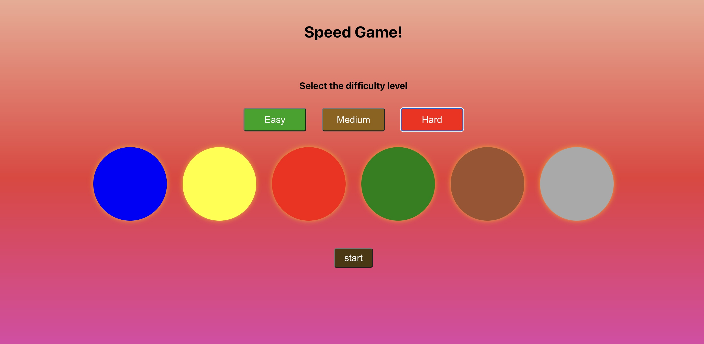

# Speed Game in React

## Build in
- React

## Run in your local machine
- git clone https://github.com/SantoshChapagai/speedgame-react
- npm start

### screen-shot

### Game overview
- Game has three levels i.e., easy, medium, and hard with four, five, and six circles respectively.
- Start button to play game appears after selecting level.
- The current level and score appear after pressing start button.
- The end bottom to end the game visible after game started.
- The start button remain invisible while playing game.
- The cat appears randomly on the circle.
- Clicking the right circle while the cat appears add 10 points to the score.
- Sound while pressing start button, when random circle activates, when player click the right circle, and when game ended.

### Ways to end game
- The game end if player click the wrong circle(i.e., other than the circle where cat visible).
- The player can press the end button to finish the game anytime.
- The game can also end if player miss three rounds continiously.

### Overlay
- The modal appears after the end game.
- The modal shows the score and conditional messages based on the player score. 
- The modal has button on the top right which takes back to the first view of the page.
- The play again button in modal allows player to start the recently played level.

